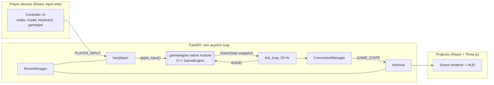
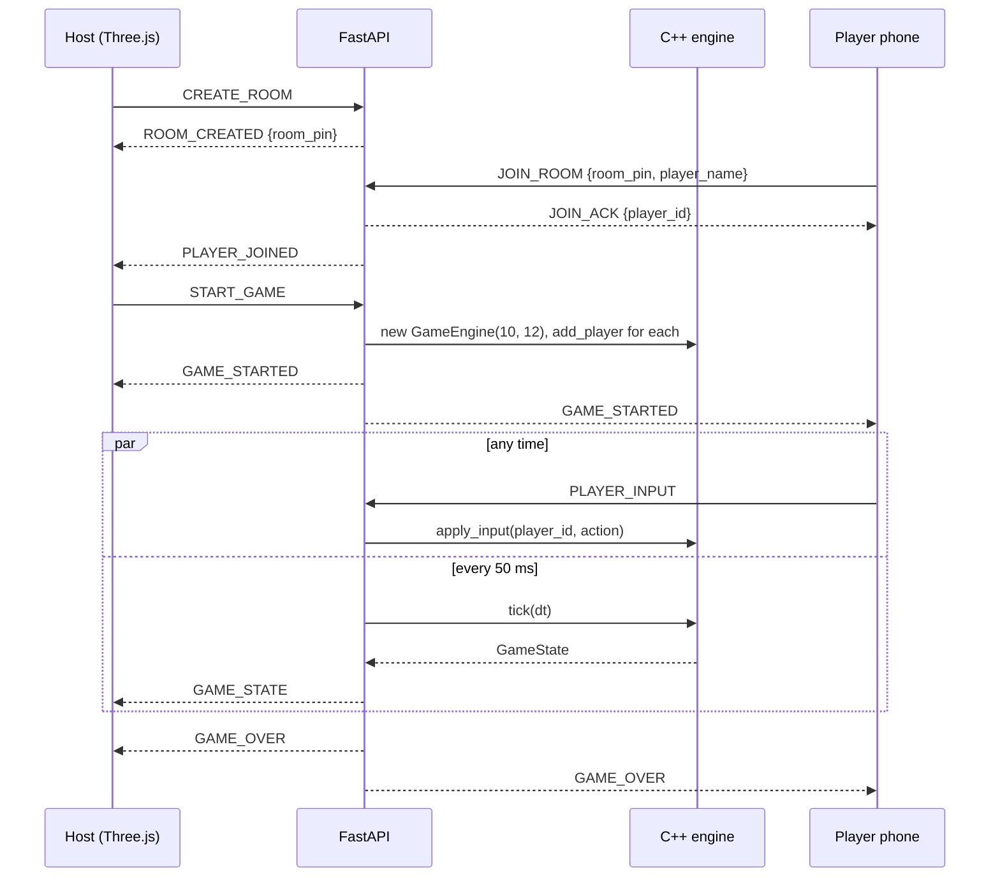

# Push to Prod

A real-time multiplayer party game for developer events. A projector shows a dark-mode 3D Frogger-style world. Players join from their phones by scanning a QR code, then steer through lanes of Bugs, Merge Conflicts, Scope Creep and Slack notifications to reach PROD.

The project uses three languages on purpose. **C++ owns the simulation, Python owns the network, JavaScript owns the pixels.** Nothing crosses those lines except JSON over WebSockets and one native module.

## Architecture



| Layer | Language | Owns | Never does |
|---|---|---|---|
| `engine/` | C++17 | Movement rules, obstacle spawning, AABB collisions, scoring, game-over | Networking, JSON, I/O |
| `server/` | Python 3.13, FastAPI | Rooms, PINs, WebSocket lifecycle, input validation, the 20 Hz clock, serialization | Collision or movement math |
| `frontend/host` | JS, React, Three.js | Rendering `GAME_STATE`, HUD, QR lobby | Simulating anything |
| `frontend/client` | JS, React | Capturing input, showing own status | Rendering the world |

## Real-time state synchronization

The server is authoritative. Phones never predict, and the host never simulates. There are two kinds of traffic.

**Event-driven (client to server).** One `PLAYER_INPUT` per discrete action. Swipes, taps, key presses and gamepad edges all collapse into the same five action strings. Nothing polls and nothing streams.

**Clocked (server to host).** `tick_loop.game_tick_loop` wakes every 50 ms (`TICK_RATE_HZ=20`), measures real `dt` with `time.monotonic()`, calls `engine.tick(dt)`, serializes the snapshot and broadcasts `GAME_STATE`. The host stores each snapshot in a React ref, which causes no re-render. A `requestAnimationFrame` loop reads that ref at display rate.

Each snapshot is the entire world. A dropped frame costs nothing because the next one replaces it, and a reconnecting client needs no replay.

## Data flow: player state and collisions, C++ to Python to JS

1. **Phone.** `useSwipe`, `useKeyboard`, `useGamepad` or a `DPadButton` calls `onAction(action)`. `App.handleAction` wraps it with `buildInputPayload` and `useWebSocket.send` writes `{"type":"PLAYER_INPUT","player_id":"…","action":"MOVE_UP"}`.
2. **Server ingress.** `routers/ws/player_ws.py` parses the frame, checks the room is `IN_GAME`, whitelists `action`, then calls `room.engine.apply_input(player_id, action)`.
3. **Engine input.** `GameEngine::applyInput` moves the player one grid unit, clamps to the grid, and on reaching the top lane does `score++` and resets `y` to 0.
4. **Engine tick.** `GameEngine::tick(dt)` spawns obstacles on a shrinking interval, moves them (`x += velocityX * dt`), runs `_checkCollisions` (AABB overlap marks a player `DEAD`), culls off-screen obstacles, and returns a `GameState` by value. **Collisions are decided only here.**
5. **Marshalling.** pybind11 converts the C++ structs to Python objects. `_sync_python_state` mirrors position, score and liveness into the Python `Player` dataclasses. `_serialise_state` builds the JSON dict, rounding floats to 3 decimals.
6. **Broadcast.** `connection_manager.broadcast_to_host` sends the frame. If `game_over` is true, `GAME_OVER` follows to everyone.
7. **Host ingress.** `useHostSocket.onmessage` parses the JSON. `App.handleMessage` assigns `gameStateRef.current = payload`.
8. **Render.** `GamePage` reads the ref each animation frame, creates, moves and removes meshes keyed by `player_id` and obstacle `id`, and draws the HUD as React DOM over the canvas.

## Session lifecycle



Reconnect: a phone that reloads sends `JOIN_ROOM` again with its stored `player_id` (`sessionStorage` key `ptp_player`) and gets its slot back with a fresh `JOIN_ACK`. If the host socket closes, the room is destroyed and players receive `HOST_DISCONNECTED`.

## WebSocket protocol

All frames are flat JSON objects with a `type` discriminator. There is no nested `payload`.

| Direction | `type` | Fields | Notes |
|---|---|---|---|
| host to server | `CREATE_ROOM` | none | Replies `ROOM_CREATED` |
| host to server | `START_GAME` | `room_pin` | Boots the C++ engine for the room |
| player to server | `JOIN_ROOM` | `room_pin`, `player_name`, `player_id?` | `player_id` present only on reconnect |
| player to server | `PLAYER_INPUT` | `player_id`, `action` | `action` is one of `MOVE_UP`, `MOVE_DOWN`, `MOVE_LEFT`, `MOVE_RIGHT`, `IDLE` |
| either to server | `PING` | none | Sent every 15 s; reply is `PONG` |
| server to host | `ROOM_CREATED` | `room_pin` | |
| server to host | `PLAYER_JOINED` / `PLAYER_LEFT` | `player_id`, `player_name`, `player_count` | Existing players also get `PLAYER_JOINED`; `PLAYER_LEFT` goes to the host only |
| server to player | `JOIN_ACK` | `player_id`, `room_pin`, `player_name` | Always the joiner's first message |
| server to both | `GAME_STARTED` | `room_pin` | |
| server to host | `GAME_STATE` | `tick`, `players`, `obstacles`, `game_over` | 20 Hz; player and obstacle snapshots are typed (P12) |
| server to both | `GAME_OVER` | `room_pin` | After the final `GAME_STATE` |
| server to player | `HOST_DISCONNECTED` | `message` | |
| server to either | `ERROR` | `code`, `message` | `INVALID_JSON`, `ROOM_NOT_FOUND`, `ROOM_FULL`, `NAME_REQUIRED`, `NO_ROOM` |

`GAME_STATE`:

```json
{
  "type": "GAME_STATE",
  "tick": 1042,
  "players": [
    { "player_id": "8d2b0a49-99b4-435c-bcb1-3b407a29be04", "player_name": "sapa",
      "x": 6.0, "y": 3.0, "score": 2, "is_alive": true,
      "stamina": 150, "is_invulnerable": true, "invulnerable_for": 9.95 }
  ],
  "obstacles": [
    { "id": "obs_00017", "type": "ESPRESSO_SHOT", "x": 4.213, "y": 3.0,
      "w": 0.8, "h": 0.9, "vx": -2.0, "lane": 3 }
  ],
  "game_over": false
}
```

Payload formatting rules (P1 to P12) are in [`.github/copilot-instructions.md`](.github/copilot-instructions.md). They apply to humans too.

## World contract

| Item | Value |
|---|---|
| Grid | 12 columns by 10 lanes (`GameEngine(10, 12)`, built in `Room.start_engine`) |
| Axes | `x` runs left to right, `y` runs bottom (START, lane 0) to top (PROD, `y == 10`) |
| Player | Starts at (6.0, 0.0). Moves 1.0 per input. Hitbox is 0.8 by 0.8, **centered** on (x, y) |
| Obstacle | Lanes 1 to 9. Speed 3.0 to 6.9 units/s, random direction. `bounds` is a **min-corner** AABB (x, y, w, h), `h = 0.9`, `w` 1.0 to 2.0 |
| Scoring | Reaching `y >= 10` gives `score += 1` and resets `y` to 0 |
| Difficulty | Spawn interval starts at 1.2 s and drops 0.005 s per spawn, floor 0.4 s |
| Game over | Non-empty room where every player is `DEAD` |
| Enums | `PlayerState`: ALIVE=0, DEAD=1, SAFE=2. `ObstacleType`: BUG=0, MERGE_CONFLICT=1, SCOPE_CREEP=2, SLACK_NOTIFICATION=3. Append only, never reorder |

## Repository layout

```text
push-to-prod/
├── dev.sh                      # build engine, run tests, launch everything
├── engine/                     # C++17 simulation (namespace ptp)
│   ├── CMakeLists.txt          # BUILD_PYBIND=ON drops the module into server/lib
│   ├── src/                    # GameEngine, Player.h, Obstacle.h, pybind_bindings.cpp
│   └── tests/test_main.cpp
├── server/                     # FastAPI; run with cwd=server
│   ├── main.py
│   ├── core/config.py          # the only place that reads env vars
│   ├── models/messages.py      # Pydantic wire schemas
│   ├── game/                   # room_manager, connection_manager, tick_loop
│   ├── routers/ws/             # host_ws.py, player_ws.py
│   └── lib/                    # gameengine.*.pyd / .so (gitignored)
├── frontend/
│   ├── host/                   # projector app: lobby, QR, Three.js scene
│   └── client/                 # phone controller
├── tests/integration_test.py   # WebSocket protocol tests, port 18766
└── .github/                    # Copilot instructions, agents, skills
```

## Getting started

Requirements: Python 3.13, Node 20.19 or newer, CMake 3.16 or newer, and a C++17 compiler (MSVC on Windows).

```bash
./dev.sh   # from Git Bash on Windows, or any bash
```

`dev.sh` checks the ports, builds the engine with `-DBUILD_PYBIND=ON`, runs the C++ tests, creates the venv, imports the module as a smoke test, runs the integration tests, then starts the three services.

| Service | URL |
|---|---|
| API | http://localhost:8000 (`/health`, `/docs`) |
| Player client | http://localhost:5173 |
| Host screen | http://localhost:5174 |

On Windows, build with `cmake --build . --config Release` and **no** `-j` flag, because MSBuild rejects it. For a LAN event, open the host screen on the projector laptop. Players on the same Wi-Fi scan the QR code.

## Testing

| Layer | Command |
|---|---|
| Engine | `engine/build/Release/engine_test.exe` (Windows) or `engine/build/engine_test` |
| Protocol | `python tests/integration_test.py` |
| Frontend | `npm run lint` in `frontend/`, and `npm run build` in each app |

## Working with Copilot agents

The `.github` folder is set up so Copilot can work across the stack without breaking the pipeline.

| File | Purpose |
|---|---|
| `copilot-instructions.md` | Always loaded. Architecture, sync model, payload rules P1 to P12, hard stops |
| `instructions/*.instructions.md` | Auto-attached by path (`applyTo`) when Copilot edits that language |
| `agents/*.agent.md` | Specialists you pick explicitly: `threejs-frontend`, `fastapi-backend`, `cpp-engine` |
| `skills/*/SKILL.md` | Step-by-step procedures Copilot loads when the task matches the skill description |

The agents hand off to each other along the data path, so a cross-stack feature runs **cpp-engine, then fastapi-backend, then threejs-frontend**. Each agent finishes with a *Contract delta* section: the exact JSON added or changed. That section is the prompt for the next agent. Handoff buttons appear in VS Code. On GitHub.com and the CLI, paste the contract delta into the next agent's prompt.

Example: `@cpp-engine add a shield pickup that survives one collision. Produce the contract delta, then hand off.`

## Known sharp edges

Agents and humans should know about these before building on top of them.

| # | Where | Problem | Fix |
|---|---|---|---|
| 1 | `connection_manager.broadcast_to_players`, `player_ws` disconnect | `is_alive` means both "dead in game" and "disconnected". Dead players are skipped by broadcasts, so a phone never sees its own death state, and since game over means everyone is dead, **nobody receives `GAME_OVER`** | Add `Player.connected`. Filter broadcasts on `connected` and `websocket`, never on `is_alive` |
| 2 | `GameEngine::_spawnObstacle` vs host `GamePage` | Id uses `_nextObstacleId++`, then type uses the already-incremented counter, so type is `(id+1) % 4` while the host derives colour from `id % 4` | Capture `seq` once and use it for both. Also serialize `type` as a string and stop parsing ids |
| 3 | `engine/tests/test_main.cpp` | `assert` compiles to nothing under Release (`NDEBUG`), and `dev.sh` builds Release, so tests pass vacuously | Use a `CHECK` macro (see the `cpp-physics-engine` skill) |
| 4 | `tick_loop` | `dt` is unclamped. A stalled event loop makes obstacles tunnel through players | Clamp `dt` to 0.1 s inside `GameEngine::tick` |
| 5 | Phase 4 tick loop | If it broadcasts full `GAME_STATE` to every phone, 50 players at 20 Hz is about 1000 large frames per second | Send phones a slim `PLAYER_STATUS` on change (see the `fastapi-ws-pipeline` skill) |
| 6 | Player AABB centered, obstacle AABB corner-origin | Renderers must offset the two differently. The Phase 3 scene adds +0.5 to player position, which the collision math does not | Define one `toWorld()` and make rendered hitboxes match engine AABBs |
| 7 | `host_ws` `CREATE_ROOM` | Re-creating a room on the same socket never destroys the old one, so finished rooms accumulate until the host disconnects | Call `destroy_room` on the previous room before creating a new one |

## Commit style

Conventional Commits with scopes `engine`, `server`, `ws`, `core`, `frontend`, `tests`, `build`. Examples: `feat(engine): add shield pickup`, `fix(server): split connected from is_alive`.